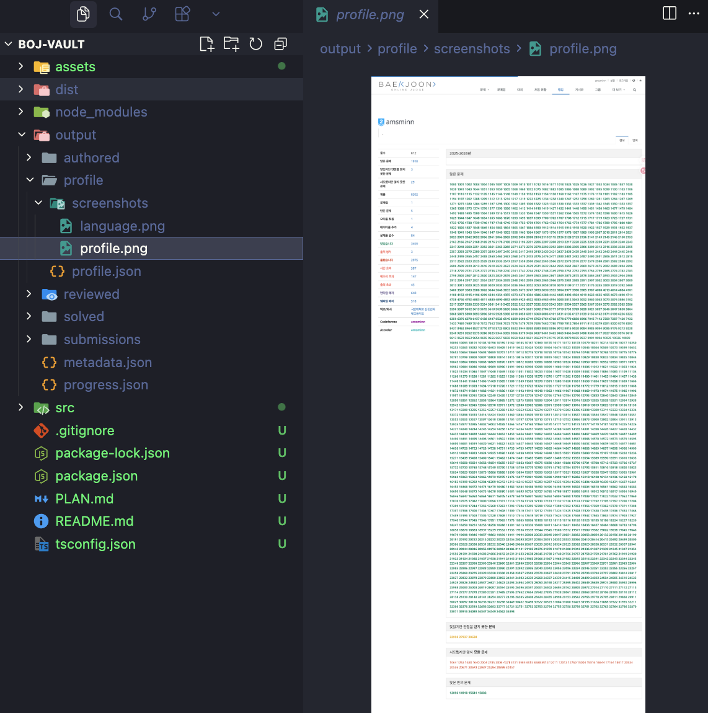
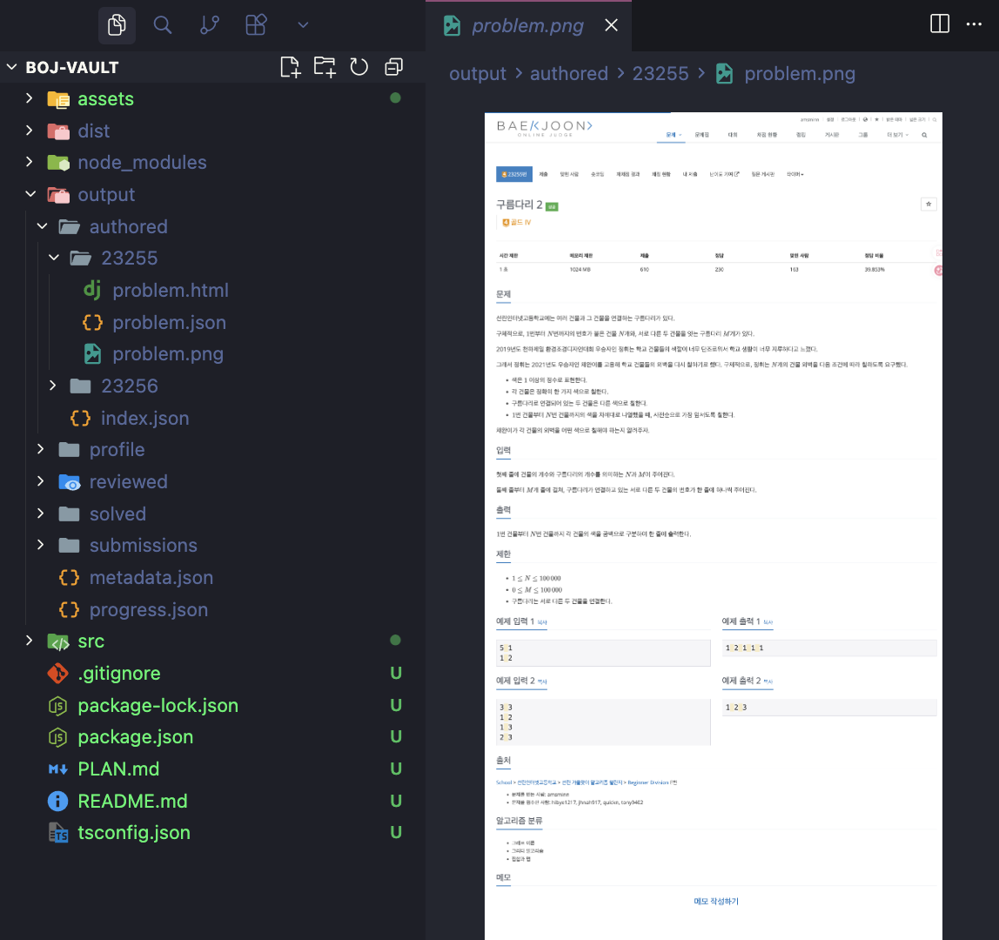
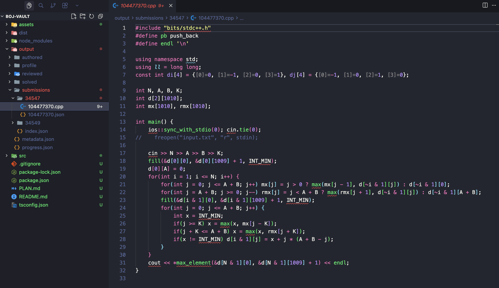

<div align="center">

<picture>
  <source media="(prefers-color-scheme: dark)" srcset="assets/logo-dark.svg">
  <source media="(prefers-color-scheme: light)" srcset="assets/logo.svg">
  
</picture>

<h3>백준 온라인 저지(BOJ) 개인 데이터를 로컬에 백업하는 CLI 도구</h3>

<a href="LICENSE"></a>
<a href="https://nodejs.org"></a>

</div>

<br>

서버 종료 전에 제출 소스코드, 출제/검수한 문제, 프로필 등을 구조화된 형태로 저장합니다.

<br>

<div align="center">

<p><em>백업된 프로필 스크린샷과 출력 디렉토리 구조</em></p>
</div>

<div align="center">
<table>
<tr>
<td></td>
<td></td>
</tr>
<tr>
<td align="center"><em>출제한 문제 본문 백업</em></td>
<td align="center"><em>제출 소스코드 백업</em></td>
</tr>
</table>
</div>

## Quickstart

```bash
git clone https://github.com/amsminn/boj-vault.git
cd boj-vault
npm install
npm run build
```

```bash
npm start -- --user <handle>
```

## 사전 준비

boj-vault는 이미 로그인된 Chrome 브라우저에 CDP(Chrome DevTools Protocol)로 연결하는 방식으로 동작합니다. Cloudflare/CAPTCHA를 우회하는 것이 아니라, 사용자가 직접 로그인한 세션을 그대로 사용합니다.

### 1. Chrome 완전히 종료

Remote Debugging 모드는 Chrome을 처음 실행할 때만 적용됩니다. **이미 실행 중인 Chrome이 있으면 모두 종료**해야 합니다.

> [!WARNING]
> macOS에서는 `Cmd+Q`로 완전히 종료하세요. Dock에서 닫기만 하면 백그라운드에 남아있을 수 있습니다.

### 2. Chrome을 Remote Debugging 모드로 실행

최신 Chrome은 CDP 사용 시 별도 데이터 디렉토리(`--user-data-dir`)가 필요합니다. boj-vault 전용 프로필이 `~/.boj-vault-chrome`에 생성되며, 로그인 세션이 유지됩니다.

**macOS:**
```bash
/Applications/Google\ Chrome.app/Contents/MacOS/Google\ Chrome \
  --remote-debugging-port=9222 \
  --user-data-dir="$HOME/.boj-vault-chrome"
```

**Linux:**
```bash
google-chrome \
  --remote-debugging-port=9222 \
  --user-data-dir="$HOME/.boj-vault-chrome"
```

**Windows:**
```bash
chrome.exe --remote-debugging-port=9222 --user-data-dir="%USERPROFILE%\.boj-vault-chrome"
```

> [!TIP]
> 처음 실행하면 새 프로필이므로 BOJ에 로그인해야 합니다. 이후에는 로그인 상태가 유지됩니다.

### 3. BOJ에 로그인

열린 Chrome 브라우저에서 [acmicpc.net](https://www.acmicpc.net)에 접속하여 로그인합니다.

## 사용법

```bash
# 전체 백업
npm start -- --user <handle>

# 특정 카테고리만 백업
npm start -- --user <handle> --only submissions
npm start -- --user <handle> --only authored
npm start -- --user <handle> --only reviewed
npm start -- --user <handle> --only solved
npm start -- --user <handle> --only profile

# 중단된 백업 재개
npm start -- --user <handle> --resume

# 출력 디렉토리 지정
npm start -- --user <handle> --output ./my-backup

# CDP 포트 변경
npm start -- --user <handle> --cdp-port 9333

# 카테고리별 최대 수집 개수 제한
npm start -- --user <handle> --limit 10

# 요청 간 딜레이 조정 (초 단위, 기본 4초)
npm start -- --user <handle> --delay 5
```

## 중단/재개

수천 개의 제출을 수집하다 중단될 수 있습니다. `--resume` 플래그를 사용하면 이전에 완료된 항목은 건너뛰고 이어서 실행합니다.

```bash
# 처음 실행 (중간에 Ctrl+C로 중단)
npm start -- --user myhandle

# 이어서 실행
npm start -- --user myhandle --resume
```

## 백업 대상

- **제출 소스코드** — 모든 제출의 원본 코드 + 메타데이터 (결과, 언어, 메모리, 시간 등)
- **출제한 문제** — 문제 본문 HTML, 테스트데이터, 스페셜 저지, 다국어 버전
- **검수한 문제** — 문제 본문 HTML, 메타데이터
- **맞은 문제 본문** — 풀었던 문제들의 제목, 본문 HTML
- **프로필** — 핸들, 티어, 맞은 문제 수, 랭킹, 페이지 스크린샷

## 출력 구조

```
output/
├── metadata.json
├── profile/
│   ├── profile.json
│   └── screenshots/
│       ├── profile.png
│       └── language.png
├── authored/
│   ├── index.json
│   └── {problem_id}/
│       ├── problem.json
│       ├── problem.html
│       ├── problem.png
│       ├── problem_en.html
│       └── testdata/
├── reviewed/
│   ├── index.json
│   └── {problem_id}/
│       ├── problem.json
│       ├── problem.html
│       └── problem.png
├── solved/
│   ├── index.json
│   └── {problem_id}/
│       ├── problem.json
│       ├── problem.html
│       └── problem.png
└── submissions/
    ├── index.json
    └── {problem_id}/
        ├── {submission_id}.json
        └── {submission_id}.{ext}
```

---

## Rate Limiting

BOJ 서버에 부담을 주지 않도록 보수적인 딜레이를 적용합니다.

- **기본 요청 간격** — 4초 (±1초 랜덤 지터)
- **페이지네이션** — 6.5초 간격
- **에러 발생 시** — 5초 간격 무한 재시도 (5xx, 타임아웃, 네트워크 에러)
- **요청 처리** — 모든 요청은 순차 처리

## Changelog

### 2026-04-16

- 모든 scraper에서 서버 에러(5xx) 및 타임아웃 발생 시 무한 재시도 적용
- 대회 제출의 문제 ID가 0으로 저장되던 문제 수정 — 소스 페이지에서 실제 문제 번호 확인
- `--resume` 시 캐시 파일 atomic write로 손상 방지
- `--limit` 적용 후 `--resume`으로 이어서 수집할 때 중복 수집되던 버그 수정
- Phase 1 제출 목록 페이지네이션 resume 지원

## 라이선스

MIT
